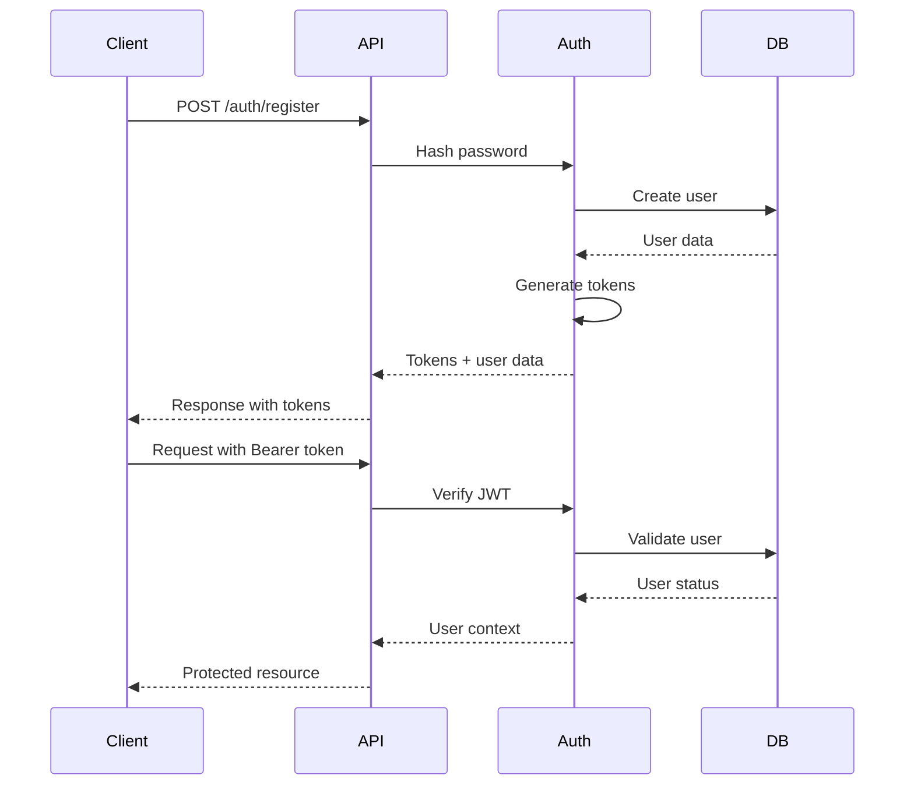
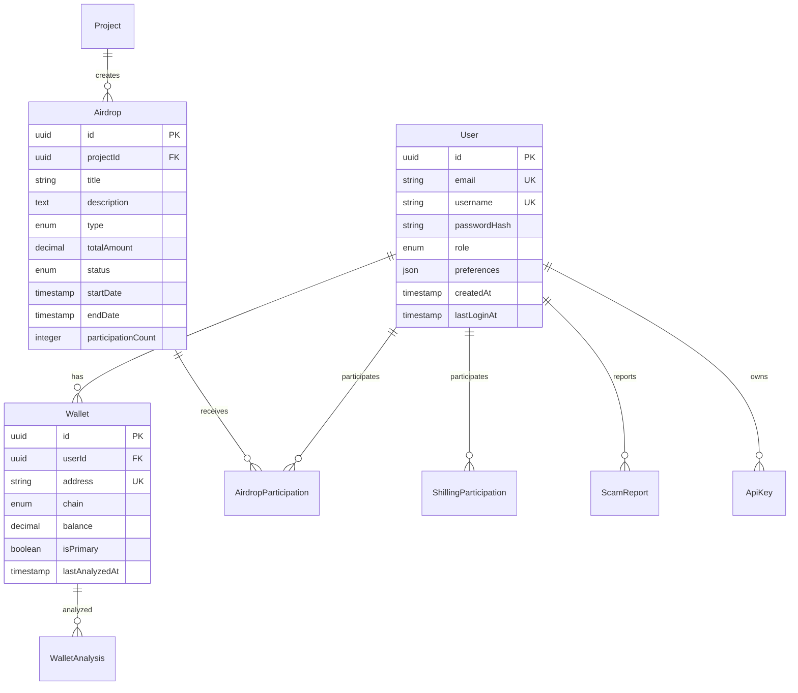

# DropIQ API - Comprehensive RESTful API Architecture

## Overview

The DropIQ API is a comprehensive, production-ready RESTful API for the DropIQ cryptocurrency airdrop aggregation platform. This architecture demonstrates best practices for building secure, scalable, and maintainable APIs handling sensitive financial data.

## 🏗️ Architecture Overview

### Core Components

1. **Authentication & Authorization System**
   - JWT-based authentication with refresh tokens
   - Role-based access control (RBAC)
   - API key management for third-party integrations
   - Multi-tier user roles with granular permissions

2. **Security Framework**
   - Multi-layered security middleware
   - Rate limiting with progressive tiers
   - Input validation and sanitization
   - XSS and SQL injection prevention
   - Request signing for sensitive operations

3. **Data Management**
   - PostgreSQL with Prisma ORM
   - Redis caching layer
   - Comprehensive database schema
   - Soft delete mechanisms
   - Audit trails and logging

4. **API Design**
   - RESTful principles with OpenAPI 3.0 specification
   - Consistent error handling
   - Comprehensive request/response validation
   - Interactive API documentation
   - Postman collection for testing

## 📁 Project Structure

```
src/
├── api/
│   ├── routes/           # API route handlers
│   │   ├── auth.ts      # Authentication endpoints
│   │   ├── airdrops.ts  # Airdrop management
│   │   ├── wallets.ts   # Wallet integration
│   │   ├── shilling.ts  # Shilling marketplace
│   │   ├── security.ts  # Security & scam detection
│   │   └── analytics.ts # Analytics & reporting
│   └── server.ts        # Main API server
├── lib/
│   ├── auth.ts          # Authentication service
│   ├── db.ts            # Database connection
│   ├── errors.ts        # Custom error classes
│   └── logger.ts        # Logging configuration
├── middleware/
│   ├── auth.ts          # Authentication middleware
│   ├── rateLimiter.ts   # Rate limiting
│   ├── validation.ts    # Request validation
│   ├── errorHandler.ts  # Error handling
│   └── security.ts      # Security headers & CORS
└── tests/
    └── api.test.ts      # Comprehensive test suite
```

## 🔐 Authentication & Authorization

### JWT Authentication Flow



### Role-Based Access Control

| Role | Permissions | Description |
|------|-------------|-------------|
| USER | Basic read/write | Standard user access |
| VERIFIED_USER | + Shilling, reporting | Verified email address |
| PREMIUM_USER | + Advanced analytics | Premium features |
| MODERATOR | + Content moderation | Community management |
| ADMIN | + System management | Full system access |

### API Key Management

- Secure key generation with cryptographic randomness
- Key rotation capabilities
- Usage tracking and rate limiting
- Permission-based key scopes

## 🛡️ Security Implementation

### Multi-Layered Security

1. **Input Validation**
   - Zod schema validation
   - SQL injection prevention
   - XSS protection
   - Content type validation

2. **Rate Limiting**
   - Progressive rate limiting by user tier
   - Endpoint-specific limits
   - IP-based blocking
   - Distributed attack protection

3. **Authentication Security**
   - JWT with short expiration
   - Secure refresh token rotation
   - Token invalidation on logout
   - Session management

4. **Data Protection**
   - Encrypted sensitive data
   - Secure password hashing
   - API key encryption
   - Audit logging

### Security Headers

```http
X-Content-Type-Options: nosniff
X-Frame-Options: DENY
X-XSS-Protection: 1; mode=block
Referrer-Policy: strict-origin-when-cross-origin
Content-Security-Policy: default-src 'self'
Strict-Transport-Security: max-age=31536000
```

## 📊 Database Architecture

### Core Schema Design



### Performance Optimizations

- **Indexing Strategy**: Strategic indexes for common queries
- **Connection Pooling**: Efficient database connection management
- **Caching Layer**: Redis for frequently accessed data
- **Query Optimization**: Efficient Prisma queries
- **Pagination**: Cursor-based pagination for large datasets

## 🚀 API Endpoints

### Authentication Endpoints

| Method | Endpoint | Description | Auth Required |
|--------|----------|-------------|---------------|
| POST | `/auth/register` | Register new user | No |
| POST | `/auth/login` | User login | No |
| POST | `/auth/refresh` | Refresh access token | No |
| POST | `/auth/logout` | User logout | Yes |
| GET | `/auth/profile` | Get user profile | Yes |
| PUT | `/auth/profile` | Update profile | Yes |

### Airdrop Endpoints

| Method | Endpoint | Description | Auth Required |
|--------|----------|-------------|---------------|
| GET | `/airdrops` | List airdrops | Optional |
| GET | `/airdrops/featured` | Featured airdrops | Optional |
| GET | `/airdrops/:id` | Get airdrop details | Optional |
| POST | `/airdrops` | Create airdrop | Admin |
| POST | `/airdrops/:id/participate` | Participate | Yes |
| GET | `/airdrops/my/participations` | My participations | Yes |

### Wallet Endpoints

| Method | Endpoint | Description | Auth Required |
|--------|----------|-------------|---------------|
| GET | `/wallets` | List wallets | Yes |
| POST | `/wallets` | Add wallet | Yes |
| GET | `/wallets/:id` | Get wallet details | Yes |
| POST | `/wallets/:id/analyze` | Analyze wallet | Yes |
| PUT | `/wallets/:id` | Update wallet | Yes |
| DELETE | `/wallets/:id` | Delete wallet | Yes |

### Security Endpoints

| Method | Endpoint | Description | Auth Required |
|--------|----------|-------------|---------------|
| GET | `/security/scam-reports` | List scam reports | Optional |
| POST | `/security/scam-reports` | Report scam | Yes |
| POST | `/security/analyze` | Analyze potential scam | Yes |
| GET | `/security/alerts` | Security alerts | Optional |

## 📈 Analytics & Monitoring

### Comprehensive Analytics

1. **Platform Analytics**
   - User growth and engagement
   - Airdrop performance metrics
   - Revenue tracking
   - System health monitoring

2. **AI-Powered Insights**
   - Trend analysis using ZAI SDK
   - Risk assessment algorithms
   - Predictive analytics
   - Automated recommendations

3. **Real-time Monitoring**
   - Request/response logging
   - Performance metrics
   - Error tracking
   - Security event monitoring

### Logging Strategy

```typescript
// Structured logging with Winston
logger.info('User action', {
  type: 'user_action',
  userId: user.id,
  action: 'airdrop_participation',
  details: { airdropId, walletAddress }
});

// Security event logging
logger.warn('Security event', {
  type: 'security_event',
  event: 'failed_login',
  details: { ip, userAgent, attempts }
});
```

## 🧪 Testing Strategy

### Comprehensive Test Coverage

1. **Unit Tests**
   - Individual function testing
   - Mock external dependencies
   - Edge case validation
   - Performance benchmarks

2. **Integration Tests**
   - API endpoint testing
   - Database integration
   - Authentication flows
   - Error handling validation

3. **Security Tests**
   - Authentication bypass attempts
   - Input validation testing
   - Rate limiting verification
   - SQL injection prevention

### Test Categories

```typescript
describe('Authentication Endpoints', () => {
  describe('POST /auth/register', () => {
    it('should register a new user successfully');
    it('should return 400 for invalid email');
    it('should return 400 for weak password');
    it('should return 409 for duplicate email');
  });
});
```

## 📚 API Documentation

### OpenAPI 3.0 Specification

- **Interactive Documentation**: Swagger UI at `/docs`
- **Schema Definitions**: Comprehensive type definitions
- **Error Responses**: Standardized error formats
- **Authentication Examples**: Clear auth flow documentation
- **Rate Limiting**: Documentation of limits and headers

### Postman Collection

- **Complete Test Suite**: All endpoints with examples
- **Environment Variables**: Dynamic configuration
- **Authentication Flows**: Automated token management
- **Test Scripts**: Response validation
- **Documentation**: Request/response examples

## 🚀 Deployment & Scalability

### Production Considerations

1. **Horizontal Scaling**
   - Stateless API design
   - Load balancer ready
   - Database connection pooling
   - Redis cluster support

2. **Performance Optimization**
   - Response caching
   - Database query optimization
   - CDN integration
   - Compression middleware

3. **Monitoring & Observability**
   - Health check endpoints
   - Metrics collection
   - Error tracking
   - Performance monitoring

### Environment Configuration

```bash
# Production Environment Variables
NODE_ENV=production
PORT=3001
DATABASE_URL=postgresql://...
REDIS_URL=redis://...
JWT_SECRET=your-jwt-secret
API_BASE_URL=https://api.dropiq.app
ALLOWED_ORIGINS=https://dropiq.app,https://www.dropiq.app
```

## 🔧 Development Setup

### Prerequisites

- Node.js 18+
- PostgreSQL 14+
- Redis 6+
- TypeScript 5+

### Installation

```bash
# Clone repository
git clone https://github.com/dropiq/api.git
cd api

# Install dependencies
npm install

# Set up environment
cp .env.example .env

# Database setup
npx prisma migrate dev
npx prisma generate

# Start development server
npm run dev
```

### Development Commands

```bash
npm run dev          # Start development server
npm run build        # Build for production
npm run test         # Run test suite
npm run lint         # Code linting
npm run type-check   # TypeScript checking
npm run db:push      # Push schema changes
npm run db:studio    # Database GUI
```

## 📋 API Usage Examples

### Authentication Flow

```typescript
// Register user
const response = await fetch('/api/v1/auth/register', {
  method: 'POST',
  headers: { 'Content-Type': 'application/json' },
  body: JSON.stringify({
    email: 'user@example.com',
    username: 'crypto_user',
    password: 'SecurePass123!',
    fullName: 'John Doe'
  })
});

const { user, tokens } = await response.json();

// Use token for authenticated requests
const airdrops = await fetch('/api/v1/airdrops', {
  headers: {
    'Authorization': `Bearer ${tokens.accessToken}`
  }
});
```

### Wallet Analysis

```typescript
// Analyze wallet for airdrop eligibility
const analysis = await fetch(`/api/v1/wallets/${walletId}/analyze`, {
  method: 'POST',
  headers: {
    'Authorization': `Bearer ${token}`,
    'Content-Type': 'application/json'
  }
});

const { analysis: walletAnalysis } = await analysis.json();
console.log('Risk Score:', walletAnalysis.riskScore);
console.log('Eligible Airdrops:', walletAnalysis.airdropEligibility);
```

### Scam Detection

```typescript
// Report suspicious activity
const report = await fetch('/api/v1/security/scam-reports', {
  method: 'POST',
  headers: {
    'Authorization': `Bearer ${token}`,
    'Content-Type': 'application/json'
  },
  body: JSON.stringify({
    title: 'Suspicious Airdrop',
    description: 'Fake airdrop asking for private keys',
    type: 'PHISHING',
    severity: 'HIGH',
    targetUrl: 'https://fake-airdrop.com'
  })
});
```

## 🎯 Best Practices Implemented

### Security Best Practices

1. **Input Validation**: Comprehensive validation using Zod schemas
2. **Authentication**: Secure JWT implementation with refresh tokens
3. **Authorization**: Role-based access control with granular permissions
4. **Rate Limiting**: Progressive rate limiting by user tier
5. **Data Protection**: Encrypted sensitive data and secure password hashing
6. **Audit Logging**: Comprehensive logging for security events

### API Design Best Practices

1. **RESTful Principles**: Proper HTTP methods and status codes
2. **Consistent Responses**: Standardized response formats
3. **Error Handling**: Comprehensive error responses with details
4. **Documentation**: OpenAPI specification with interactive docs
5. **Versioning**: API versioning for backward compatibility
6. **Testing**: Comprehensive test coverage

### Performance Best Practices

1. **Database Optimization**: Strategic indexing and query optimization
2. **Caching**: Redis caching for frequently accessed data
3. **Connection Pooling**: Efficient database connection management
4. **Pagination**: Efficient pagination for large datasets
5. **Compression**: Response compression for faster transfers

## 📞 Support & Contributing

### Getting Help

- **Documentation**: [API Docs](https://api.dropiq.app/docs)
- **Issues**: [GitHub Issues](https://github.com/dropiq/api/issues)
- **Discord**: [DropIQ Discord](https://discord.gg/dropiq)
- **Email**: api@dropiq.app

### Contributing

1. Fork the repository
2. Create a feature branch
3. Make your changes
4. Add tests for new functionality
5. Ensure all tests pass
6. Submit a pull request

### License

This project is licensed under the MIT License - see the [LICENSE](LICENSE) file for details.

---

**DropIQ API** - Building the future of cryptocurrency airdrop aggregation with security, scalability, and developer experience at the forefront.